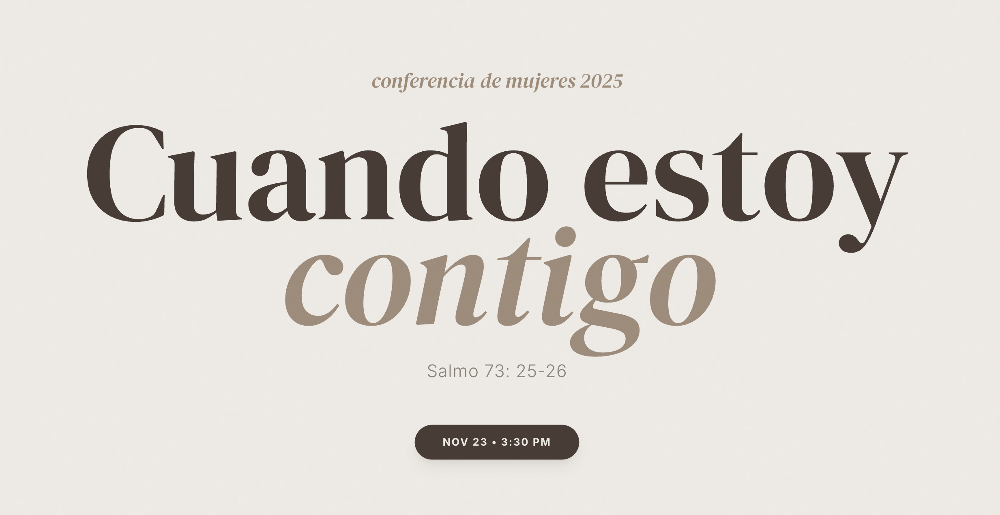

<div align="center">

  # CONFERENCIA MUJERES 2024 | WEB CONCEPT
  
  
  
  
  <br />
  
  


  <br />
  <br />

  <a href="https://github.com/LuisandovalU/conferencia-mujeres">
    
  </a>
  <a href="https://conferencia-mujeres.vercel.app/">
    
  </a>

</div>

---

## ∎ Descripción del Proyecto

Este repositorio aloja el código fuente de una plataforma web diseñada como concepto oficial para la "Conferencia de Mujeres 2024". El objetivo principal de este desarrollo fue la transición técnica desde el desarrollo web tradicional (HTML/CSS/JS) hacia arquitecturas modernas basadas en componentes.

El proyecto se centra en la **limpieza visual**, la **experiencia de usuario (UX)** y la presentación profesional de eventos masivos, demostrando cómo la tecnología puede elevar la identidad de una organización.

## ∎ Arquitectura y Tecnologías

El desarrollo se fundamenta en un stack moderno para asegurar rendimiento y escalabilidad:

| Componente | Tecnología | Propósito |
| :--- | :--- | :--- |
| **Core** |  | Construcción de interfaz basada en componentes. |
| **Framework** |  | Renderizado optimizado y enrutamiento. |
| **Estilos** |  | Diseño responsivo y estética personalizada. |
| **Control** |  | Gestión de versiones. |

## ∎ Objetivos de Aprendizaje

Este proyecto marca un hito en mi ruta de ingeniería de software, enfocándome en:

* **Migración Tecnológica:** Evolución de Vanilla JS a React/Next.js.
* **Componentización:** Creación de elementos reutilizables y modulares.
* **Diseño UI/UX:** Implementación de interfaces limpias, legibles y atractivas sin sobrecarga visual.
* **Presentación de Eventos:** Estructuración de información clave para conferencias (hero section, speakers, agenda).

## ∎ Instalación y Despliegue

Si deseas ejecutar este proyecto en un entorno local:

1.  **Clonar el repositorio:**
    ```bash
    git clone [https://github.com/LuisandovalU/conferencia-mujeres.git](https://github.com/LuisandovalU/conferencia-mujeres.git)
    ```

2.  **Instalar dependencias:**
    ```bash
    cd conferencia-mujeres
    npm install
    ```

3.  **Ejecutar servidor de desarrollo:**
    ```bash
    npm run dev
    ```

4.  **Visualizar:**
    Abre tu navegador en `http://localhost:3000`.

## ∎ Roadmap y Futuro

Este proyecto es una base sólida sobre la cual planeo iterar. Las próximas actualizaciones contemplan:

* [ ] Integración de Backend para registro de usuarios.
* [ ] Base de datos para gestión dinámica de horarios y ponentes.
* [ ] Implementación de pasarela de pagos (simulación).
* [ ] Optimización SEO avanzada.

---

<div align="center">
  
  **Desarrollado por Luis Alberto Sandoval**
  
  <a href="https://github.com/LuisandovalU">
    
  </a>
  <a href="https://linkedin.com/in/tu-usuario">
    
  </a>

</div>
